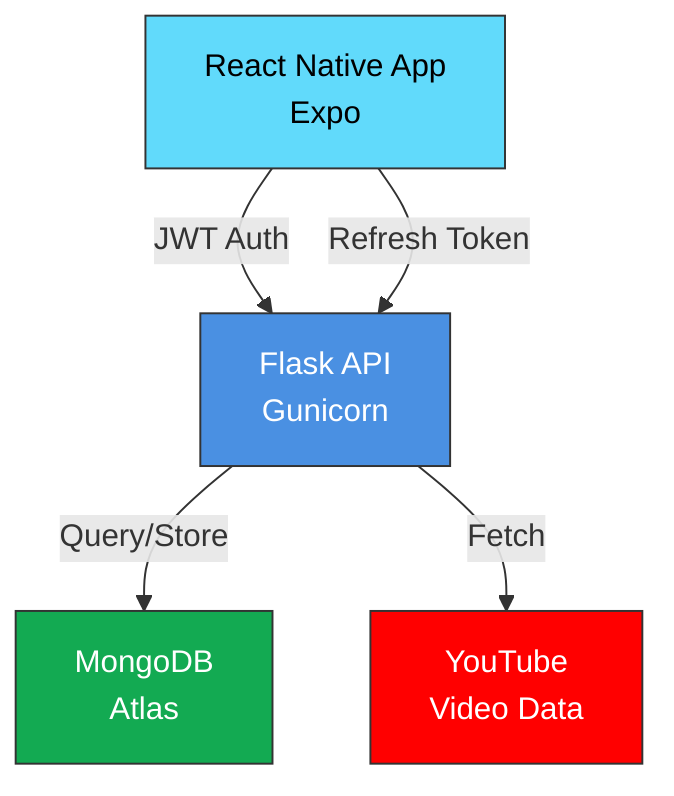

# API-First Video App

A React Native (Expo) mobile app backed by a Flask API with MongoDB. The mobile app is a thin client — it calls APIs, stores JWT securely, renders server-provided data, and sends user actions. All business logic and security lives on the backend.

**Live Demo:** https://proxyplay.onrender.com (Backend deployed on Render)

## System Architecture



**Key Features:**
- ✅ JWT authentication with 1-hour access tokens + 30-day refresh tokens
- ✅ Rate limiting on login (5 attempts/min per IP)
- ✅ Auto-token refresh on 401 (transparent to user)
- ✅ Pagination with infinite scroll (10 videos/page)
- ✅ Admin API key protection for video management
- ✅ YouTube stream abstraction with short-lived playback tokens
- ✅ CORS enabled for mobile/web access
- ✅ Production-ready deployment (Gunicorn + Docker)

## Repository Structure
- Backend: [backend/](backend)
  - Flask app entry: [backend/app.py](backend/app.py)
  - Routes: [backend/routes/auth.py](backend/routes/auth.py), [backend/routes/video.py](backend/routes/video.py)
  - Utilities: [backend/utils/jwt_helper.py](backend/utils/jwt_helper.py), [backend/utils/auth_middleware.py](backend/utils/auth_middleware.py), [backend/utils/video_token.py](backend/utils/video_token.py)
  - Dependencies: [backend/requirements.txt](backend/requirements.txt)
  - Environment example: [backend/.env.example](backend/.env.example)
- Mobile App (Expo): [videoApp/](videoApp)
  - Auth screens: [videoApp/app/login.tsx](videoApp/app/login.tsx), [videoApp/app/signup.tsx](videoApp/app/signup.tsx)
  - Tabs + Dashboard: [videoApp/app/(tabs)/index.tsx](videoApp/app/(tabs)/index.tsx)
  - Player: [videoApp/app/player.tsx](videoApp/app/player.tsx)
  - Settings (placeholder): [videoApp/app/(tabs)/explore.tsx](videoApp/app/(tabs)/explore.tsx)
  - API client: [videoApp/src/services/api.ts](videoApp/src/services/api.ts)

## Local Development (Windows)

### Backend Setup

Prerequisites:
- Python 3.13+
- MongoDB (local or Atlas)

```powershell
cd C:\Users\jayan\Desktop\api-first-video-app\backend
python -m venv venv
venv\Scripts\Activate
pip install -r requirements.txt
```

Configure `backend/.env`:
```
MONGO_URI=mongodb+srv://<username>:<password>@<cluster>.mongodb.net/?appName=<app>
SECRET_KEY=your-secret-key-here
ADMIN_KEY=your-admin-key-here
```

Run:
```powershell
python app.py
# Server: http://localhost:5000 (local) or http://<your-lan-ip>:5000 (device)
```

### Frontend Setup

Prerequisites:
- Node.js 18+
- Expo CLI

```powershell
cd C:\Users\jayan\Desktop\api-first-video-app\videoApp
npm install
npm start
```

Create `videoApp/.env` for local testing:
```
EXPO_PUBLIC_API_URL=http://<your-lan-ip>:5000
```

Select platform (web, Android, iOS) in Expo menu.

## App Screens & Behavior

- No business logic, filtering, or hardcoded content in the app.
- The app calls APIs, stores a JWT, renders server data, and sends user actions.

1. Authentication
- Signup: Name, Email, Password — on success store JWT and go to Dashboard.
- Login: Email, Password — on success store JWT and go to Dashboard.

2. Dashboard (Home)
- Shows 2 active videos from the backend.
- Each tile: Thumbnail, Title, Description.
- Tap a tile to open the Video Player.

3. Video Player
- Plays video via backend-abstracted stream endpoint.
- Controls: Play/Pause, Seek, Mute/Unmute (via WebView/YouTube embed controls).
- The app consumes `stream_url` returned after validating `playback_token` — no raw YouTube links.

4. Settings
- Shows user name and email.
- Logout button clears JWT.

## API Reference

### Auth Endpoints
- POST `/auth/signup`
  - Body: `{ name, email, password }`
  - Returns: `{ access_token, refresh_token }`
- POST `/auth/login`
  - Body: `{ email, password }`
  - Returns: `{ access_token, refresh_token }`
  - **Rate Limited:** 5 attempts per minute per IP (returns 429 on limit)
- POST `/auth/refresh`
  - Body: `{ refresh_token }`
  - Returns: `{ access_token }` (new 1-hour token)
- GET `/auth/me`
  - Header: `Authorization: Bearer <access_token>`
  - Returns: `{ name, email }`
- POST `/auth/logout`
  - Header: `Authorization: Bearer <access_token>`
  - Invalidates all refresh tokens for the user

### Video Endpoints
- GET `/dashboard?page=1&limit=10`
  - Header: `Authorization: Bearer <access_token>`
  - Returns: `{ videos: [...], pagination: { page, limit, total, pages } }`
  - Supports infinite scroll with pagination
- POST `/video` (Admin only)
  - Header: `X-Admin-Key: <admin_key>`
  - Body: `{ title, description, youtube_id, thumbnail_url, is_active }`
  - Returns: `{ message, id }`
- GET `/video/<id>/stream?token=<playback_token>`
  - Validates short-lived playback token
  - Returns: `{ stream_url }` (safe YouTube embed URL)
- POST `/video/<id>/watch`
  - Header: `Authorization: Bearer <access_token>`
  - Logs video watch event for analytics

## Data Models

User:
```
{
  _id: ObjectId,
  name: string,
  email: string,
  password_hash: bytes,
  created_at?: Date
}
```

Video:
```
{
  _id: ObjectId,
  title: string,
  description: string,
  youtube_id: string,
  thumbnail_url: string,
  is_active: boolean
}
```

## Implementation Notes

### Security
- **JWT Auth:** HS256, 1-hour expiry for access tokens, 30-day expiry for refresh tokens
- **Refresh Token Storage:** Stored in MongoDB `refresh_tokens` collection; invalidated on logout
- **Rate Limiting:** Login endpoint limited to 5 attempts/minute per IP
- **Playback Tokens:** Short-lived (5 min), video-bound, prevents raw YouTube URL exposure
- **Admin API Key:** Required for `/video` POST (video management)

### Architecture
- **Backend:** Flask + Flask-CORS + PyJWT + Gunicorn (production server)
- **Frontend:** React Native (Expo) + Axios + AsyncStorage
- **Database:** MongoDB Atlas (cloud)
- **Deployment:** Docker + Render (auto-scaling, free tier available)

### Key Files
- [backend/app.py](backend/app.py) — Flask app, CORS, logging
- [backend/routes/auth.py](backend/routes/auth.py) — Auth, rate limiting, token refresh
- [backend/routes/video.py](backend/routes/video.py) — Video management, pagination, stream abstraction
- [backend/utils/jwt_helper.py](backend/utils/jwt_helper.py) — Access & refresh token generation
- [backend/utils/auth_middleware.py](backend/utils/auth_middleware.py) — JWT validation, CORS preflight bypass
- [backend/utils/video_token.py](backend/utils/video_token.py) — Playback token generation
- [videoApp/src/services/api.ts](videoApp/src/services/api.ts) — Axios with auto-token refresh and platform-aware baseURL
- [videoApp/app/_layout.tsx](videoApp/app/_layout.tsx) — Navigation & auth check
- [videoApp/app/login.tsx](videoApp/app/login.tsx) — Login screen with validation
- [videoApp/app/signup.tsx](videoApp/app/signup.tsx) — Signup screen
- [videoApp/app/(tabs)/index.tsx](videoApp/app/(tabs)/index.tsx) — Dashboard with pagination & infinite scroll
- [videoApp/constants/theme.ts](videoApp/constants/theme.ts) — Neon theme & colors

## Deployment (Render)

### 1. Push to GitHub
```powershell
git init
git add -A
git commit -m "Initial commit"
git remote add origin https://github.com/<your-username>/api-first-video-app.git
git branch -M main
git push -u origin main
```

### 2. Deploy on Render

1. Go to [render.com](https://render.com) and sign in with GitHub
2. Create New → Web Service
3. Connect your repository
4. Configure:
   - **Name:** ProxyPlay
   - **Language:** Docker (auto-detected)
   - **Branch:** main
   - **Region:** Oregon (US West)
   - **Instance Type:** Free (or Starter for production)

5. Environment Variables:
   ```
   MONGO_URI=mongodb+srv://<username>:<password>@<cluster>.mongodb.net/?appName=<app>
   SECRET_KEY=your-secret-key-here
   ADMIN_KEY=your-admin-key-here
   ```

6. Click **Deploy**. Build takes ~5 min. Your API is live at:
   ```
   https://proxyplay.onrender.com
   ```

### 3. Update Mobile App

Create/update `videoApp/.env`:
```
EXPO_PUBLIC_API_URL=https://proxyplay.onrender.com
```

Restart Expo for changes to take effect.

## Testing

### Backend (Local)
```bash
# Test signup
curl -X POST http://localhost:5000/auth/signup \
  -H "Content-Type: application/json" \
  -d '{"name":"John Doe","email":"john@example.com","password":"secret123"}'

# Test login
curl -X POST http://localhost:5000/auth/login \
  -H "Content-Type: application/json" \
  -d '{"email":"john@example.com","password":"secret123"}'
# Save the access_token and refresh_token from response

# Test /auth/me
curl http://localhost:5000/auth/me \
  -H "Authorization: Bearer <access_token>"

# Test dashboard (with pagination)
curl http://localhost:5000/dashboard?page=1&limit=10 \
  -H "Authorization: Bearer <access_token>"

# Test admin endpoint (add video)
curl -X POST http://localhost:5000/video \
  -H "Content-Type: application/json" \
  -H "X-Admin-Key: proxyplay_admin_2026" \
  -d '{
    "title":"Sample Video",
    "description":"A test video",
    "youtube_id":"dQw4w9WgXcQ",
    "thumbnail_url":"https://i.ytimg.com/vi/dQw4w9WgXcQ/maxresdefault.jpg",
    "is_active":true
  }'

# Test rate limiting (attempt login 6+ times quickly)
for i in {1..6}; do
  curl -X POST http://localhost:5000/auth/login \
    -H "Content-Type: application/json" \
    -d '{"email":"test@example.com","password":"wrong"}'
done
# 6th request should return 429 Too Many Requests

# Test token refresh
curl -X POST http://localhost:5000/auth/refresh \
  -H "Content-Type: application/json" \
  -d '{"refresh_token":"<refresh_token>"}'
```

### Mobile App
1. Open the app on device/emulator
2. **Signup:** Create an account
3. **Login:** Log in with the account
4. **Dashboard:** Scroll through videos (infinite scroll after 10)
5. **Player:** Tap a video to play
6. **Settings:** View profile, test logout
7. **Token Refresh:** Wait for access token to expire (~1h) → next API call auto-refreshes silently

## Troubleshooting

### Backend Issues
| Issue | Solution |
|-------|----------|
| `Port 5000 already in use` | Change port in `app.py` or kill the process: `lsof -ti :5000 \| xargs kill -9` |
| `MongoDB connection refused` | Check MongoDB is running and `MONGO_URI` is correct in `.env` |
| `ADMIN_KEY not found` | Ensure `ADMIN_KEY=proxyplay_admin_2026` is in `backend/.env` |
| Render deployment fails | Check logs: Render Dashboard → Logs tab; ensure env vars are set |

### Frontend Issues
| Issue | Solution |
|-------|----------|
| `Network Error in axios` | Verify backend is running; check `EXPO_PUBLIC_API_URL` in `.env` |
| `Android emulator can't reach backend` | Use `10.0.2.2` instead of `localhost` (already handled in code) |
| `401 on every request` | Clear AsyncStorage or reinstall app; check token in browser DevTools |
| `Page won't refresh` | Restart Expo with `npm start -- --clear` |

## Future Enhancements
- Search/filter videos by title or category
- User profiles & watch history
- Recommendations based on watch events
- Dark/light theme toggle
- Offline mode with caching
- Push notifications
- Livestream support